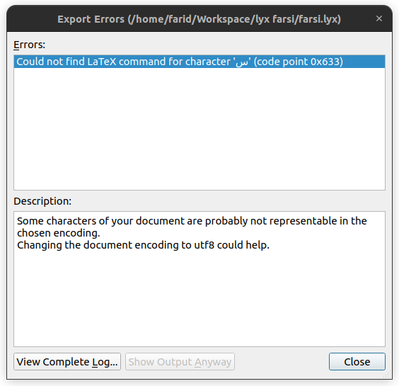
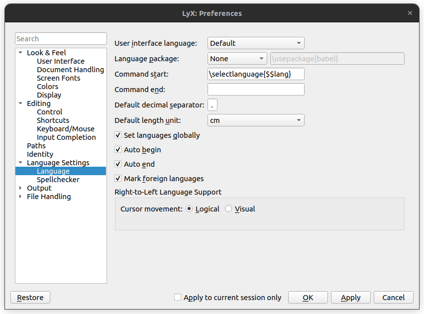
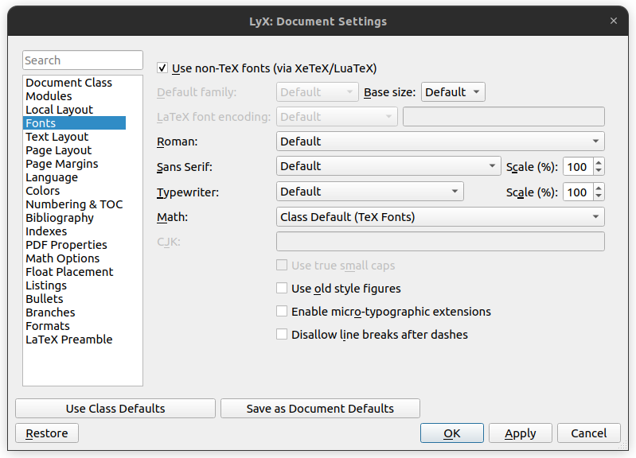
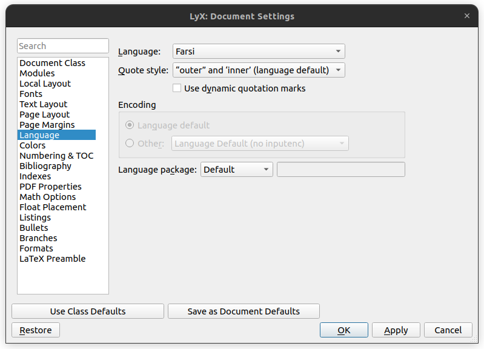
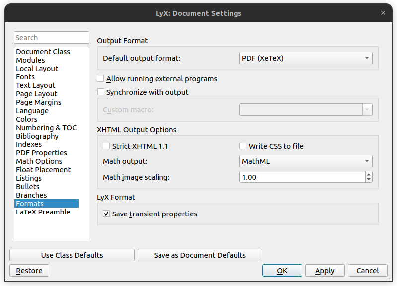
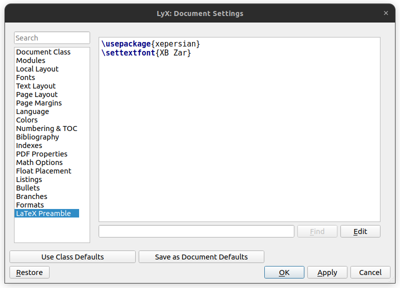

# نگارش فارسی در LyX

## فونت XB Zar

<div dir="rtl">

فونت های XB Zar را از لینک زیر دانلود و روی سیستم خود نصب کنید.

</div>

[لینک دانلود](./fonts/XBZar.zip)

## تنظیمات

<div dir="rtl">

اگر در ابتدای کار متنی فارسی مثل «سلام» را تایپ کنید و روی View کلیک کنید، با اروری به شکل زیر مواجه میشوید:

</div>

<div align="center">



</div>

<div dir="rtl">

برای رفع این مشکل،

</div>

<div dir="rtl">

۱. از سربرگ Tools وارد Preferences شوید و Language package را روی None قرار دهید که به طور خودکار از پکیج های دیگر استفاده نشود. در نهایت روی OK کلیک کنید تا تنظیمات اعمال شود.

</div>

<div align="center">



</div>

<div dir="rtl">

۲. از سربرگ Document وارد Settings شوید. در قسمت Fonts، تیک گرینه Use non-TeX fonts را بزنید.

</div>

<div align="center">



</div>

<div dir="rtl">

۳. در قسمت Language، زبان را به Farsi تغییر دهید. برای اطمینان، بهتر است که Language package را به None تغییر دهید.

</div>

<div align="center">



</div>

<div dir="rtl">

۴. در قسمت Formats، گزینه PDF (XeTeX) را برای Default ouput format انتخاب کنید.

</div>

<div align="center">



</div>

<div dir="rtl">

۵. در قسمت LaTeX Preamble، دو خط زیر را اضافه کنید:

</div>

```tex
\usepackage{xepersian}
\settextfont{XB Zar}
```

<div align="center">



</div>

<div dir="rtl">

در نهایت روی OK کلیک کنید تا تنظیمات اعمال شود.

</div>

<div dir="rtl">

۶. از سربرگ Edit گزینه Language را پیدا کنید. گزینه Farsi باید اضافه شده باشد. روی آن کلیک کنید.

</div>

## خروجی

<div dir="rtl">

اگر پیشتر متن فارسی نوشته بودید، آن را پاک کنید و دوباره بنویسید. روی View کلیک کنید تا فایل خروجی نمایش داده شود.

</div>

## منابع

- [درخواست راهنمایی برای تایپ در محیط ویرایشگر lyx](http://qa.parsilatex.com/22079/%D8%AF%D8%B1%D8%AE%D9%88%D8%A7%D8%B3%D8%AA-%D8%B1%D8%A7%D9%87%D9%86%D9%85%D8%A7%DB%8C%DB%8C-%D8%A8%D8%B1%D8%A7%DB%8C-%D8%AA%D8%A7%DB%8C%D9%BE-%D8%AF%D8%B1-%D9%85%D8%AD%DB%8C%D8%B7-%D9%88%DB%8C%D8%B1%D8%A7%DB%8C%D8%B4%DA%AF%D8%B1-lyx)
- [X Series 2](http://wiki.irmug.com/index.php/X_Series_2)